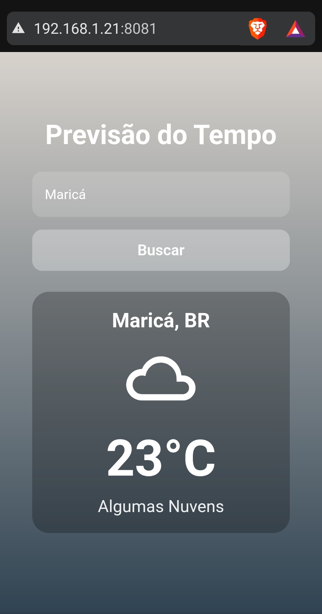
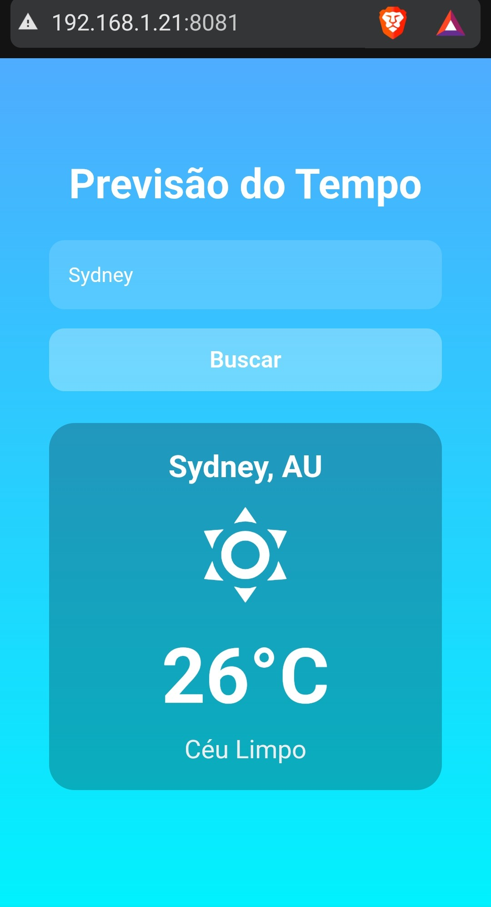
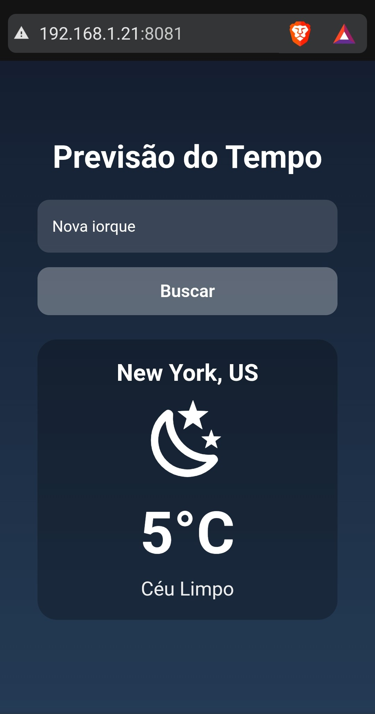
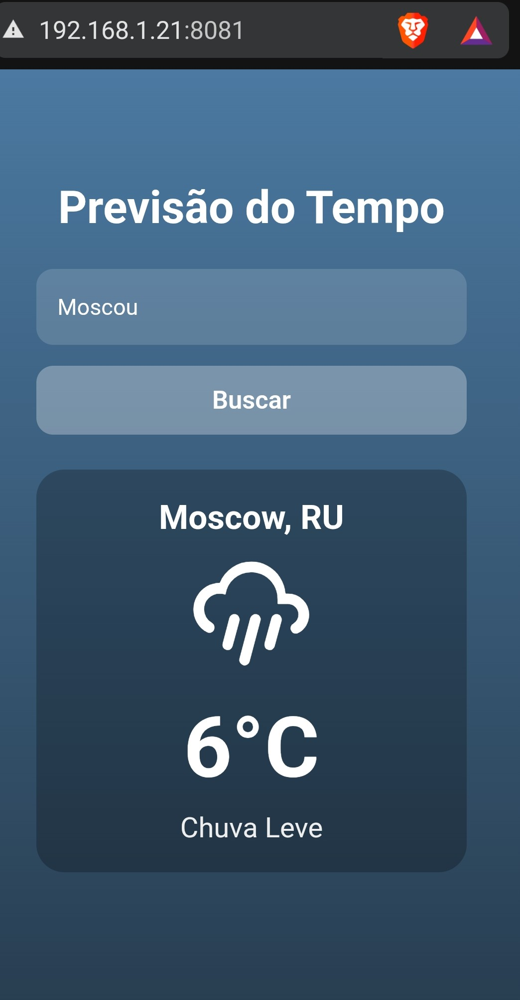

# Weather App — Previsão do Tempo com React Native + Expo

Um aplicativo simples de previsão do tempo, desenvolvido com **React Native** e **Expo**, consumindo a API pública **OpenWeatherMap**.

O app permite buscar o clima atual de qualquer cidade do mundo, exibindo:

- Nome da cidade e país
- Temperatura atual
- Descrição do clima
- Ícone representativo (sol, chuva, nublado etc.)
- Gradiente dinâmico baseado no clima
- Detecção automática de dia/noite

---

## Prints do projeto rodando

<p align="center">
  
  
  
  
</p>


---

# Arquitetura do Projeto

O projeto segue uma estrutura organizada, separando:

- lógica da API (`services/`)
- constantes (`constants/`)
- funções utilitárias (`utils/`)
- componentes (`components/`)
- telas (`screens/`)
- estilos (`styles/`)

## 📁 Estrutura de Diretórios

```md
project/
│
├── .env
├── app.json
├── App.js
│
├── src/
│   ├── screens/
│   │   └── HomeScreen.jsx
│   │
│   ├── services/
│   │   └── weatherService.js
│   │
│   ├── constants/
│   │   ├── gradients.js
│   │   └── weatherIcons.js
│   │
│   ├── utils/
│   │   ├── getWeatherVisuals.js
│   │   └── isNight.js
│   │
│   ├── components/
│   │   └── WeatherCard.jsx
│   │
│   ├── styles/
│   │   └── homeStyles.js
│
└── package.json
```

---

# Como Rodar o Projeto

## 1. Clonar o repositório

```bash
git clone https://github.com/fhfraga/react-weather-app
cd weather-app
```

## 2. Instalar dependências

```bash
npm install
```

## 3. Criar o arquivo `.env`

```env
EXPO_PUBLIC_WEATHER_API_KEY=SUA_CHAVE_AQUI
```

Pegue sua chave grátis em:  
https://openweathermap.org/api

## 4. Rodar o App

```bash
npx expo start
```

# Como o App Funciona

### 1. Usuário digita a cidade  
Usa um `<TextInput>`.

### 2. App chama a API  
A função `fetchWeather()` faz a requisição:

```
GET https://api.openweathermap.org/data/2.5/weather
```

### 3. Processamento  
- ícone correto  
- cores do gradiente  
- dia ou noite  
- temperatura formatada  

### 4. Exibição  
O componente `WeatherCard` mostra tudo em uma interface minimalista.

---
